# ice-game

拿 [ice-render](https://github.com/ice-render/ice-render) 引擎和
[ice-web-components](https://github.com/ice-render/ice-web-components) 的画布控件搭的**游戏厅**：
小游戏、掌机、XP 桌面上的扫雷 —— 全部由引擎画在同一张 `<canvas>` 上，**画面里没有一个位图资源**。

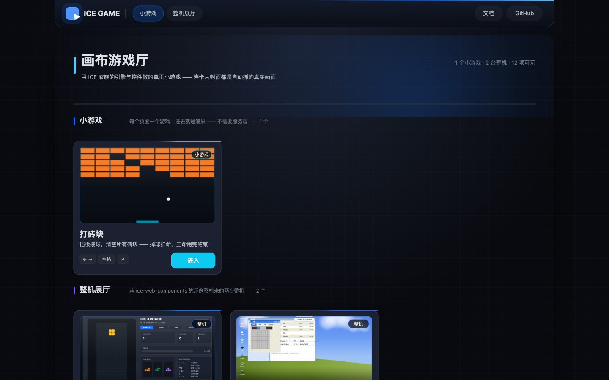

> ⚠️ **Just for fun.** 纯娱乐与探索项目，不是产品，不要拿它当生产级 UI。

首页有**吸顶导航**（品牌 + 分区锚点 + 文档/GitHub 入口）与**页脚**（ICE 家族各仓的 GitHub 链接）：

| 吸顶导航 | 页脚 |
|---|---|
|  | 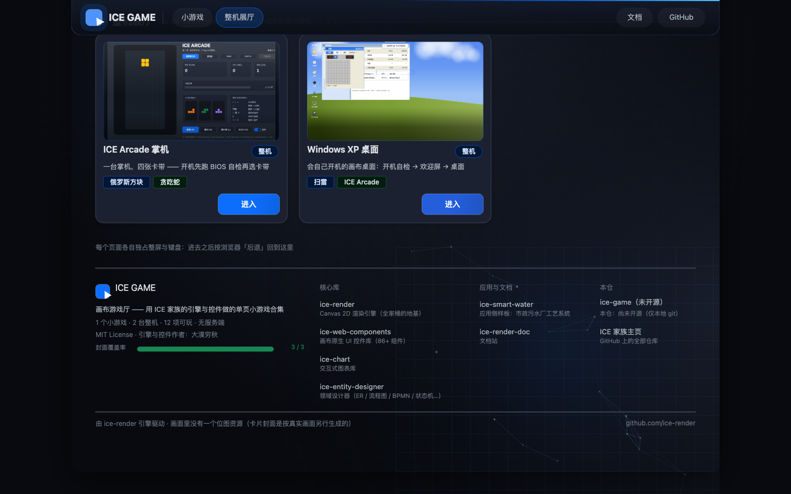 |

> 导航栏是**第二块画布**（`#navbar`，`position: fixed`）——首页滚的是浏览器窗口，
> 画在页面画布里会跟着内容滚走。页脚里的链接地址来自 `src/domain/family-repos.ts`，
> 每条都核实过可访问；本仓 `ice-game` 尚未开源，页脚里如实标成纯文本**而不是编一个链接**。

## 1. 这里有什么

**自研小游戏**（`src/games/<slug>/`，一个游戏一个目录）：

| | 页面 | 玩法 |
|---|---|---|
| **打砖块** | `breakout.html` | 挡板接球、清空砖块；掉球扣命，三命用完结束；越靠上的砖越值钱 |

| 打砖块 · 进行中 | 打砖块 · 游戏结束 |
|---|---|
| 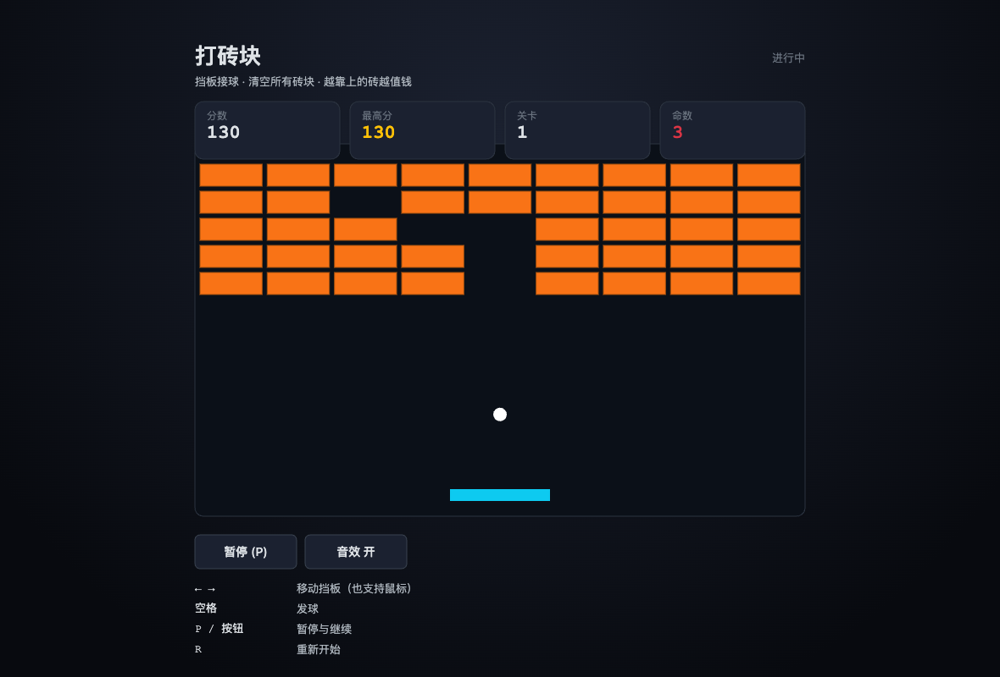 | 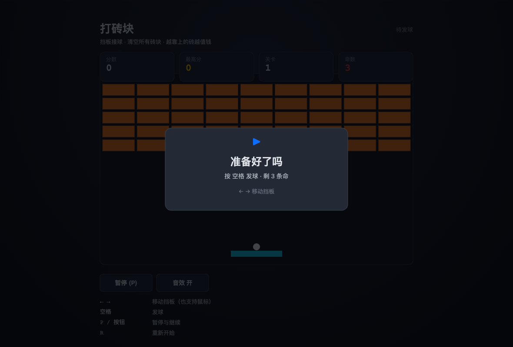 |

**整机展厅**（`src/ported/<slug>/`，从 `ice-web-components/examples/` 移植）：

| | 页面 | 内容 |
|---|---|---|
| **ICE Arcade 掌机** | `arcade.html` | 开机先跑 BIOS 自检（CPU / RAM / VRAM / SOUND / CART），再过启动菜单插卡带。四张卡带：俄罗斯方块、贪吃蛇、2048、CHIP-8 |
| **Windows XP 桌面** | `windows-xp.html` | 一台**会开机**的桌面：黑屏自检 → 蓝色欢迎屏 → 桌面淡入 + 开机音。八个程序：扫雷、ICE Arcade、记事本、画图、我的电脑、我的文档、Internet Explorer、显示属性 |

> 首页每张卡片上的**封面图是自动抓的真实画面**（`npm run covers`），不是手工准备的图片 ——
> 见第 5 节。改了游戏画面重跑一次即可，封面不会和代码脱节。

| 掌机 · 俄罗斯方块 | 掌机 · BIOS 自检 |
|---|---|
| 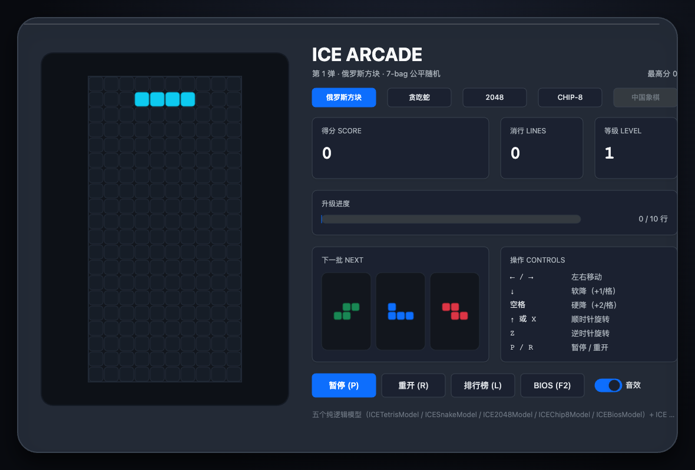 | 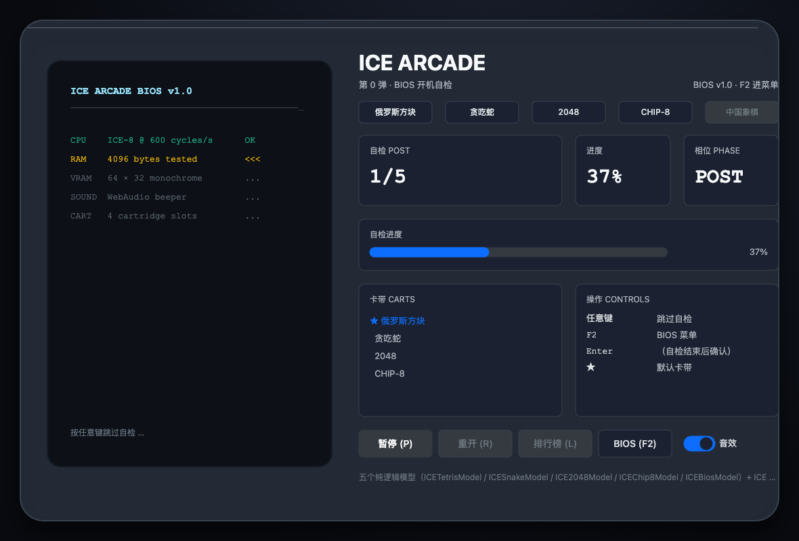 |

| XP · 开机自检 | XP · 欢迎屏 |
|---|---|
| 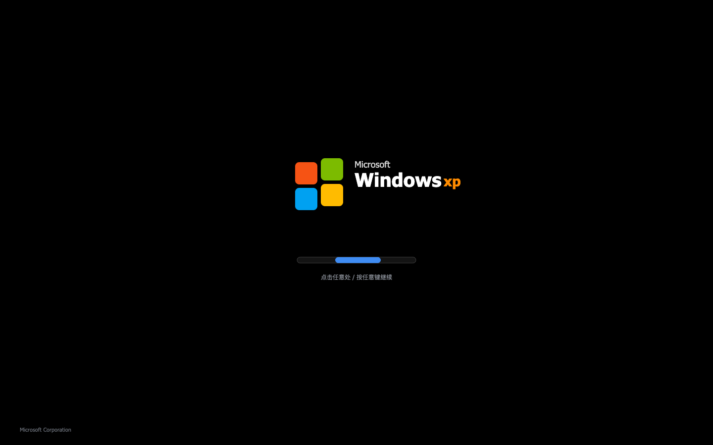 | 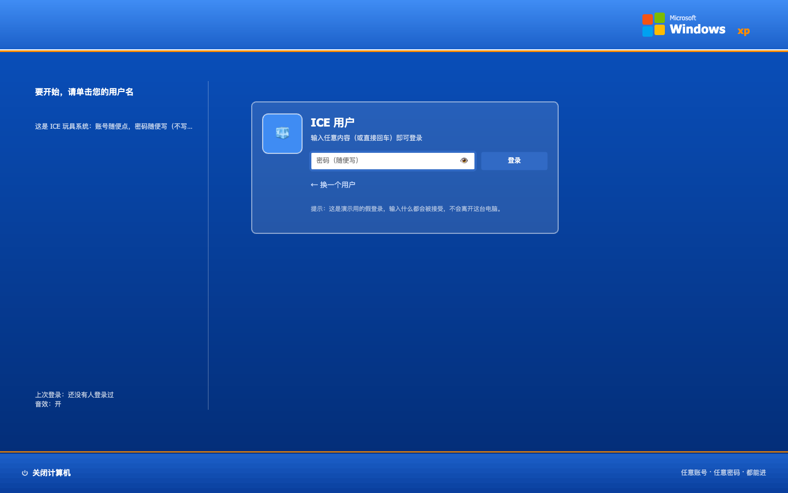 |

| XP · 桌面 | XP · 扫雷 |
|---|---|
| 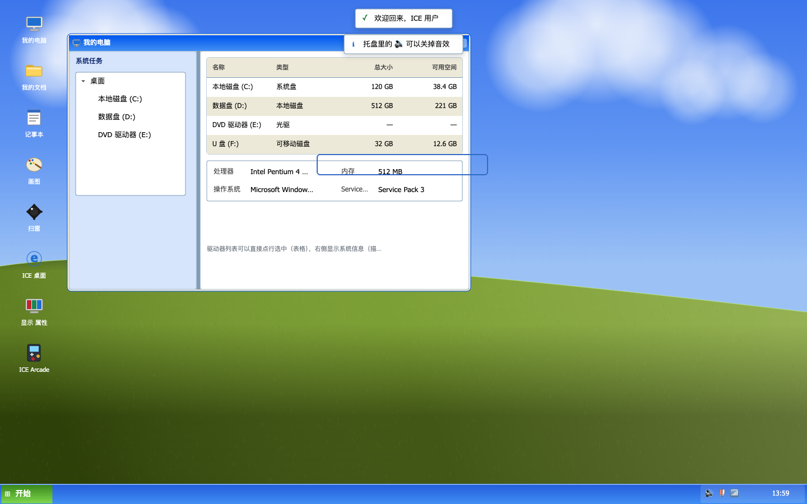 | 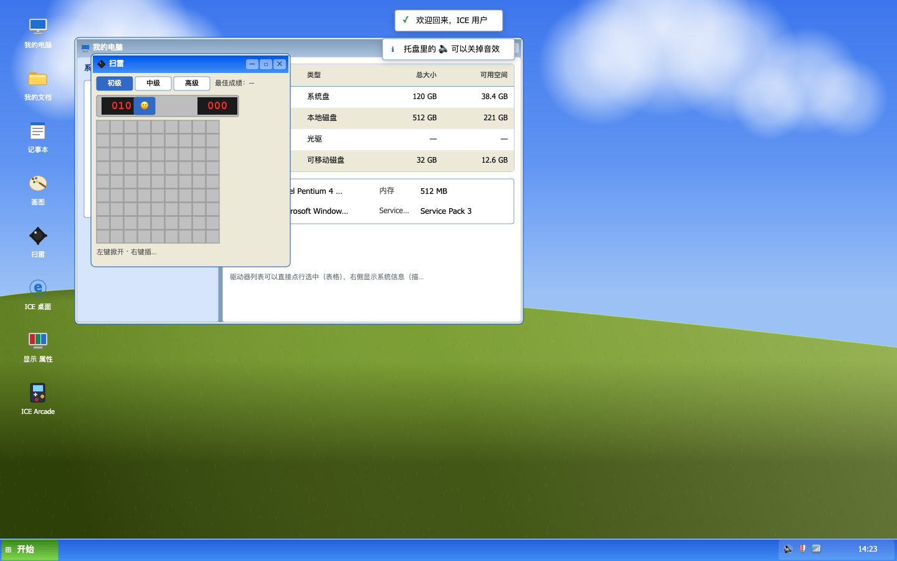 |

## 2. 快速开始

```bash
npm install
npm run build
npm run dev            # 或 npm run serve —— 本机 http://localhost:8098
```

> **必须走 http，不能直接开 `file://`**：XP 里的 Internet Explorer 是真 `fetch()`，`file://` 下不工作。
> 端口撞了用 `ICE_GAME_PORT=8099 npm run dev`（本机 8096/8097 被无关常驻服务占着）。
> 自研小游戏**不依赖 fetch**，构建产物是相对路径 —— 单个 HTML + JS 拷走就能玩。

## 3. 加一个新游戏（三步，不用改配置）

```bash
npm run new:game -- tic-tac-toe --title "井字棋"
```

生成 `src/games/<slug>/{meta.json,model.ts,main.ts}` + 一份规则单测，**是一个能跑起来的最小玩法**
（限时计分 + 暂停 + 重开 + 最高分存档），照着改即可：

```
1. 改 meta.json      标题 / 说明 / 操作 / 主色 —— 会直接出现在游戏厅首页的卡片上
2. 改 model.ts       你的游戏规则（纯逻辑，零运行时依赖）
   改 tests/games/<slug>/model.test.ts   换成你自己规则里最容易写错的那几条
3. npm run dev       自动出现在构建、首页与 e2e（http://localhost:8098/<slug>.html）
```

**不用改** webpack / 首页 / e2e —— 三处都由目录驱动：

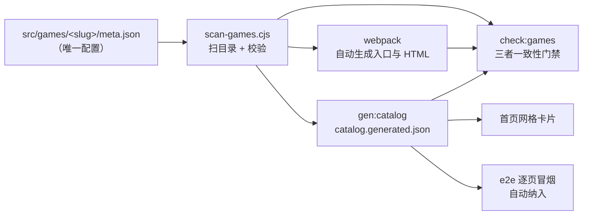

删掉一个游戏 = 删目录（`check:games` 会提醒你重新构建以清掉 `dist/` 里的旧产物）。

## 4. 工程结构

```
src/
├─ domain/            纯逻辑 + 目录（零运行时依赖）
│  ├─ catalog.ts        目录 API：分组 / 查询 / 统计
│  ├─ catalog.generated.json  ← 生成物（gen:catalog，勿手改）
│  └─ family-repos.ts   ICE 家族各仓的 GitHub 地址（页脚/导航的链接来源）
├─ kit/               ★ 小游戏底座：新游戏别再各写一遍
│  ├─ page.ts           画布 + 引擎 + 主题 + dpr
│  ├─ shell.ts          标题 / 数值卡 / 按钮 / 操作说明 / 暂停与结束覆盖层
│  ├─ loop.ts           帧循环（dt 上限、暂停即停帧）
│  ├─ input.ts          键盘 → 语义动作（repeat 抑制、失焦清键）
│  ├─ storage.ts        localStorage 容错（零依赖，可纯 node 单测）
│  ├─ high-scores.ts    最高分榜（复用库里的 ICEHighScoreModel）
│  └─ audio.ts          WebAudio 合成音效（零音频文件）
├─ games/<slug>/      ★ 自研小游戏：meta.json + main.ts + model.ts
├─ ported/<slug>/     ★ 上游移植的整机（index.html / main.ts 是生成物，禁手改）
├─ templates/page.html  小游戏共用页面骨架（HTML 只写一份）
└─ home/              游戏厅首页
   ├─ main.ts           hero + 卡片网格 + 页脚（画布高度按内容算）
   ├─ navbar.ts         吸顶导航（独立画布 #navbar，position: fixed）
   ├─ footer.ts         页脚（家族仓库链接；布局是纯函数，量高与渲染共用）
   ├─ chrome.ts         导航/页脚共用的品牌徽标、链接、分隔线
   ├─ index.html        两块画布 + CSS（导航固定、主体滚动）
   └─ covers/<slug>.png ← 生成物（npm run covers 自动抓，勿手改）
```

两个分区是**物理隔离**的：`games/` 是开发区（就是要改），`ported/` 是上游产物（禁止手改，
跟随上游只需 `npm run sync:upstream`）。详见 [AGENTS.md](./AGENTS.md)。

> **为什么首页有两块画布**：页面主体（`#canvas`）随窗口滚动，而导航要永远可见。
> 画在主体画布里的话导航会跟着滚走（要它不动就得每帧按 `scrollY` 重画）。
> 于是用家族里现成的「岛」套路：`#navbar` 是一块独立画布 + 独立 `ICE` 实例，
> CSS `position: fixed` 吸在视口顶部 —— 真正的吸顶、零重绘成本，
> 页面画布那边一行不用改（只在 CSS 里留出顶部位置）。
> 库里的 `ICEAffix` / `ICEAnchor` **用不上**：它们服务的是画布内滚动容器（`ICEScrollPane`），
> 而这里的滚动发生在窗口上。

## 5. 门禁

```bash
npm run types:check   # tsc --noEmit（含 kit、games、e2e、跨包类型接线）
npm test              # jest：domain / kit / 各游戏 model —— 不需要引擎产物也不需要 jsdom
npm run check:wiring  # 家族三件套接线：真打一次包，断言每个包只进来一份
npm run check:catalog # 目录生成物是否最新
npm run build         # 扫目录构建（会把封面拷进 dist/covers/）
npm run check:games   # 目录 ↔ 生成物 ↔ 构建产物 ↔ 封面 四者一致
npm run test:e2e      # 真 Chrome：像素 + 真鼠标真键盘 + 逐页冒烟
npm run verify        # 上面除 e2e 外全部
npm run covers        # 抓卡片封面（真跑一遍游戏，见下）
npm run screenshots   # 重抓 README 的截图（改过版面就要重跑，别手截）
```

三个页面都没有可断言的 DOM 结构，所以 e2e 分三层，**缺一层就会出现"看起来通过其实没验证"**：

1. **状态机**：直接断言 `model` 的相位 / 分数 / 命数；
2. **交互**：真鼠标点画布控件、真键盘驱动输入 —— 断言状态真的变了；
3. **像素**：`opaqueRatio` + `inkRatio` + 颜色数（只刷一层底色的空画布会在后两项露馅）。

### 版面体检：越界与构件交叠

画布应用的版面错乱**没有天然的报错** —— 两个构件压在一起、数值卡压住游戏区，
引擎照常绘制，只有人眼看截图才发现（实测就是这样抓到一处 18px 的重叠）。
所以 `e2e/support.ts` 提供了 `expectLayoutClean(page, …)`：用引擎的
`getAccessibilityTree()` 查越界与"部分交叠"，并已接进各页的用例：

| 页面 | 查什么 |
|---|---|
| 小游戏（每个，自动覆盖） | 待发球 + 进行中两个状态 |
| 掌机 | BIOS 自检、卡带运行两个阶段 |
| XP | 八窗全开的极端场景（窗口层叠 + 任务栏排布） |
| 首页 | 主体画布（卡片网格 + 页脚）与吸顶导航画布 |

判据做了四层排除（祖先-后代 / 不占地的透明容器 / 完全包含 / ≤2px 分线）与
跨窗口遮挡放行 —— 每一层都是被误报逼出来的，依据都写在 `support.ts` 的注释里。

### 卡片封面：自动抓，不手工准备

```bash
npm run build && npm run covers          # 全部页面
npm run covers -- breakout              # 只重拍某个（改了一个游戏时省时间）
```

`scripts/shoot-covers.mjs` 用真 Chrome 打开每个页面、**驱动它到有内容的状态**
（打砖块要打到有分数、XP 要开机并开一个窗口）、再把画布合成为 16:9 的封面：

- 圆角 / accent 描边 / 顶部光泽都**烘进 PNG**（引擎的 `ICEImage` 不支持圆角裁剪，
  离屏画布的 `clip()` 可以 —— 所以圆角只能在生成时做）；
- 每个页面的"摆姿势"与"取景"写在脚本的 `DRIVERS` 里，**不是必须的**：
  没登记的页面走默认（等它画完 + 整张画布），所以新游戏天然就有封面；
- 缺封面**不算错误**：首页画占位块并在底部提示跑 `npm run covers`；
  真正会被门禁拦下的是**不一致**（生成物说有封面、`dist/covers/` 里却没有）。

## 6. 依赖

```jsonc
"dependencies": {
  "@damoqiongqiu/ice-chart": "file:../ice-chart",      // 图表（新游戏可能用到）
  "ice-render": "file:../ice-render",                  // 引擎
  "ice-web-components": "file:../ice-web-components"   // 画布控件 + 游戏模型
}
```

三个包都是 `file:` 软链到同级仓库（与 [ice-smart-water](https://github.com/ice-render/ice-smart-water) 同模式），
改完兄弟仓 `npm run build` 立刻吃到新产物。**加新依赖时必须同时补三处**（package.json → webpack alias →
tsconfig paths），漏了会在构建或类型检查期直接报错，见 `AGENTS.md` 铁律 2。

## 7. 已知现象

两条**上游示例的既有行为**（不是本仓缺陷，改动属上游职责）：

1. **XP 的 IE 程序会报一个 404（`/gallery.html`）** —— 上游的 IE 演示会真 `fetch()` 一个
   演示页面，本仓 `dist/` 里没有它，于是 IE 显示"找不到页面"。**那正是它要演示的效果**。
2. **XP 任务栏的任务按钮不显示** —— 移植页里没有把它们画出来（实测：按钮位置像素与任务栏
   空白处完全相同，强制重绘后依旧；仓里更早的截图也没有这些按钮）。
   因为 `src/ported/` 禁止手改，本仓不做修，e2e 里按子树放行并写清了依据。

> 另外：`ice-render` 引擎仓**正在被其他人并行重构**，若恰好撞上对方重建 `dist/` 的瞬间，
> 本仓的 `tsc` / webpack 可能报"找不到模块"之类的**瞬时**错误 —— 重跑即恢复，不用改代码。

## 8. License

MIT，见 [LICENSE](./LICENSE)。引擎与组件库的版权归原作者（大漠穷秋）。
上游示例页的音效是 WebAudio 现场合成的原创音、图标全部由引擎图元绘制，**不含任何 Microsoft 素材**。

玩得开心 🕹
