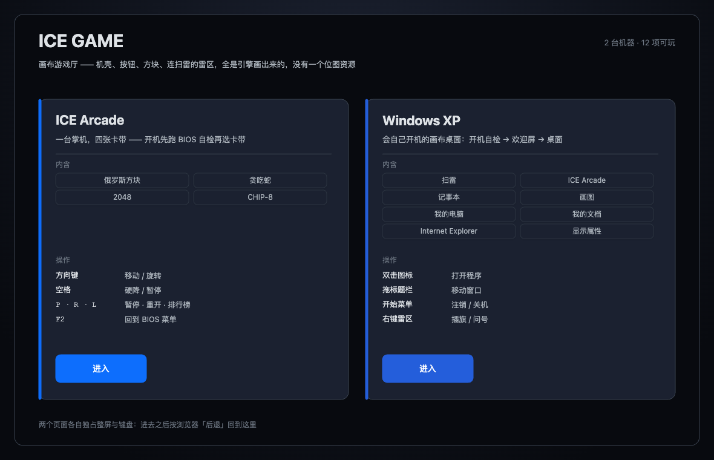
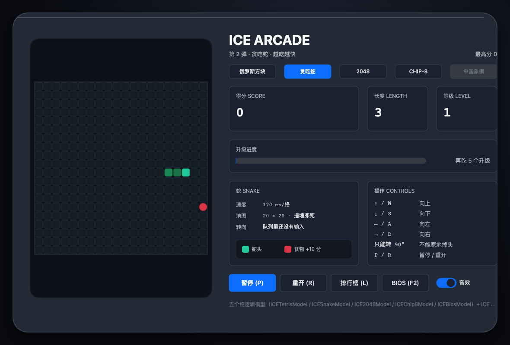
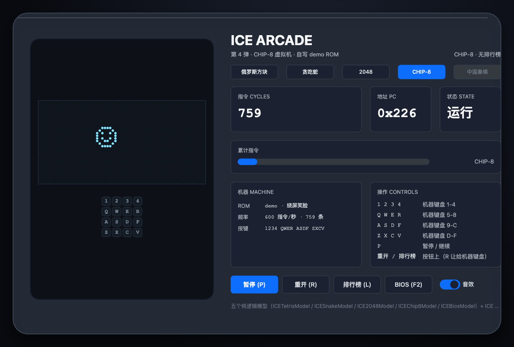

# ice-game

拿 [ice-render](https://github.com/ice-render/ice-render) 引擎和
[ice-web-components](https://github.com/ice-render/ice-web-components) 的画布控件拼成的**游戏厅**：
机壳、屏幕、按钮、方块、连扫雷的雷区，全部由引擎画在同一张 `<canvas>` 上 —— **画面里没有一个位图资源**。



> ⚠️ **Just for fun.** 纯娱乐与探索项目，不是产品，不要拿它当生产级 UI。

## 1. 三台机器

| | 页面 | 内容 |
|---|---|---|
| **ICE Arcade** | `arcade.html` | 一台掌机：开机先跑 BIOS 自检（CPU / RAM / VRAM / SOUND / CART），再过经典启动菜单，然后插卡带。四张卡带：俄罗斯方块、贪吃蛇、2048、CHIP-8 |
| **Windows XP** | `windows-xp.html` | 一台**会开机**的画布桌面：黑屏自检 → 蓝色欢迎屏（选用户、随便输个密码）→ 桌面淡入 + WebAudio 开机音。八个程序：扫雷、ICE Arcade、记事本、画图、我的电脑、我的文档、Internet Explorer、显示属性 |
| **游戏厅首页** | `index.html` | 本工程唯一自己写的页面：把目录铺成两张卡片，点进去就是那台机器 |

| 掌机 · 俄罗斯方块 | 掌机 · BIOS 自检 |
|---|---|
|  |  |

| XP · 开机自检 | XP · 欢迎屏 |
|---|---|
|  |  |

| XP · 桌面 | XP · 扫雷 |
|---|---|
|  |  |

## 2. 快速开始

```bash
npm install
npm run sync:upstream   # 从 ice-web-components/examples 抽取两个游戏页（见第 4 节）
npm run build
npm run serve           # http://localhost:8097
```

> **必须走 http，不能直接开 `file://`**：XP 里的 Internet Explorer 是真 `fetch()`，`file://` 下不工作。
> 另外 `npm start`（webpack-dev-server）也是 8097。

门禁：

```bash
npm run types:check   # tsc --noEmit
npm test              # jest：纯业务层（src/domain），不需要引擎产物也不需要 jsdom
npm run build         # webpack 三入口
npm run test:e2e      # 真 Chrome 逐页跑：像素 + 真交互
npm run screenshots   # 重抓 README 的截图（改过版面就要重跑，别手截）
npm run verify        # types:check + test + build
```

## 3. 工程结构

```
ice-game/
├─ src/
│  ├─ domain/game-catalog.ts     目录：本仓"能玩什么"的唯一事实来源（纯数据 + 纯函数）
│  ├─ home/                      游戏厅首页（自己写的画布页）
│  └─ games/
│     ├─ arcade/                 ← 从上游抽取（生成物，勿手改）
│     └─ windows-xp/             ← 从上游抽取（生成物，勿手改）
├─ scripts/
│  ├─ sync-upstream.mjs          抽取器：上游 examples/*.html → src/games/<name>/
│  └─ shoot-screenshots.mjs      截图器：真 Chrome 跑一遍再截图
├─ e2e/                          Playwright：像素 + 真鼠标 / 真键盘
└─ tests/domain/                 jest：目录层单测
```

### 三个入口，不是一个 HTML 里的三个页签

本仓与 [ice-smart-water](https://github.com/ice-render/ice-smart-water)（单 HTML + 页签）**有意不同**：
那是一个业务系统的多个模块，共用工况 / 筛选状态；这里是**三台互不相干的机器**，各自独占整屏、
独占键盘，各自有"开机自检"这类一次性流程。硬塞进一个页面里，只会让"切页要重建整台机器"比
"开个新页面"更贵。

## 4. 与上游的关系（重要）

`src/games/{arcade,windows-xp}/` 是**从 `ice-web-components/examples/` 逐字抽取的生成物**：

- 玩法 / 版面的**事实来源在上游页**，本仓不手改这两个目录 —— 要改就改上游，然后
  ```bash
  npm run sync:upstream
  ```
- 抽取器只做两件事：把 head（style + canvas）与内联脚本正文**原样**搬过来；删掉两行
  `<script src="…umd.js">`，改成本仓 `main.ts` 顶部的 `import` —— `import * as` 拿到的命名空间
  对象与 UMD 全局**形状一致**（`ICE.ICEBoxLayout`、`ICEWEB.ICEPanel` 照旧），所以正文一字不用改。
- 抽取器自带**逐字自校验**（抽出的正文必须是上游文件的子串），并打印行数 / 字节 / sha256 指纹，
  同步时对一眼就知道上游动没动。

**推论**：拷贝之后两个工程是分叉的。上游修了 `arcade.html` 的 bug，ice-game 不会自动拿到 ——
这是有意的（本仓要能自由改版面），跟随上游就是重跑那条命令。

打包侧：`webpack.config.js` 把 `ice-render` 与 `ice-web-components` **都** `resolve.alias` 到同级
兄弟仓库目录，强制全工程只有一份 `ice-render`（否则 `typeId` 注册表与事件总线会错位）。

## 5. 测试口径

三个页面都没有可断言的 DOM 结构，所以 e2e 分三层，缺一层就会出现"看起来通过其实没验证"：

1. **像素**：`opaqueRatio`（画上去的占比）+ `inkRatio`（与主色明显不同的占比）+ 颜色数。
   只刷一层底色的空画布在第二、三项上会露馅。
2. **目录**：掌机的卡带数、XP 的程序数必须与 `src/domain/game-catalog.ts` 写的一致。
3. **交互**：真鼠标点卡带、真键盘掰方向键、真双击图标开扫雷 —— 断言模型状态真的变了。

| 掌机 · 贪吃蛇 | 掌机 · CHIP-8 |
|---|---|
|  |  |

## 6. License

MIT，见 [LICENSE](./LICENSE)。引擎与组件库的版权归原作者（大漠穷秋）。
上游示例页里的音效是 WebAudio 现场合成的原创音，图标全部由引擎图元绘制，**不含任何 Microsoft 素材**。

玩得开心 🕹
